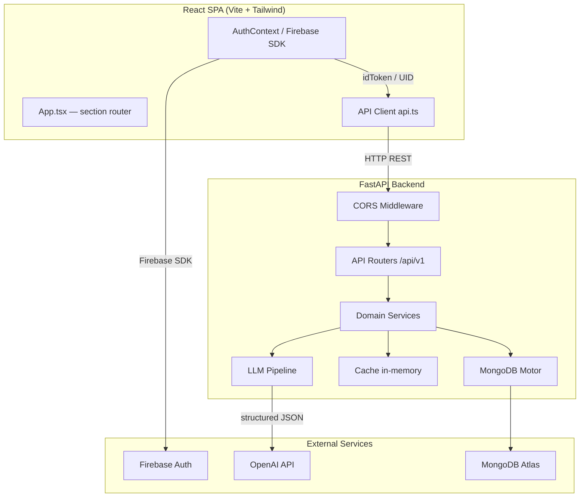

# Design Document: Swasth Parivar

## Overview

Swasth Parivar is a family wellness AI web application that fuses Ayurvedic principles with modern AI to deliver personalised nutrition and lifestyle guidance. A household owner registers, adds family members, completes a Prakriti (Ayurvedic body-type) assessment for each member, and then generates AI-powered weekly meal plans tailored to the combined dosha profile of the family. The system also derives a weekly grocery list from the meal plan and provides seasonal and constitution-specific wellness guidance.

The system is composed of three main layers:

1. **React + TypeScript SPA** (Vite, Tailwind CSS) — single-page client served from a CDN or static host.
2. **FastAPI backend** (Python 3.13, Motor/MongoDB, Firebase Admin SDK) — REST API with an async LLM pipeline.
3. **External services** — OpenAI Chat Completions API (structured outputs), Firebase Authentication, MongoDB Atlas.


## Architecture



### Startup / Lifespan

`backend/app/lifespan.py` runs on FastAPI startup:

1. Reads `features.yml`, `model_map.yml`, `settings.yml` via `config.py` (all `lru_cache`-ed).
2. Initialises `Cache` (in-memory, configurable TTL, default 7 days).
3. Initialises `LLMClient` with the task→model map from `model_map.yml`.
4. Connects to MongoDB via Motor (`init_mongo`).
5. Creates `RotationRepository` if DB is available.
6. Attaches all resources to `app.state` for dependency injection via `request.app.state`.

On shutdown, cache is cleared, MongoDB connection closed, and LLM client closed.

### Configuration Hierarchy

| Layer | Source | Precedence |
|---|---|---|
| Defaults | `config.py` hardcoded | lowest |
| File | `settings.yml`, `features.yml`, `model_map.yml` | medium |
| Environment | `.env` / `TASK_MODELS__*`, `FEATURES__*` | highest |


## Components and Interfaces

### Backend API Routers

All routers are mounted under `/api/v1` except the health check.

| Router file | Prefix | Endpoints |
|---|---|---|
| `health_check.py` | `/` | `GET /healthz` |
| `users.py` | `/api/v1/users` | `POST /register`, `POST /login` |
| `members.py` | `/api/v1` | `POST /member`, `GET /members/{user_id}`, `PUT /members/{member_id}`, `DELETE /members/{member_id}` |
| `dosha_detector.py` | `/api/v1` | `POST /prakriti/assessment` |
| `meal_plan_generate.py` | `/api/v1` | `POST /meal-plan/generate` |
| `recipe_generate.py` | `/api/v1` | `POST /recipe/generate` |
| `grocery_generate.py` | `/api/v1` | `POST /grocery/list` |
| `grocery_category_generate.py` | `/api/v1` | `GET /grocery/categories` |

#### Request Header Overrides (all AI endpoints)

- `X-Model: <model_name>` — overrides the task model if `allow_model_override: true` in `features.yml`.
- `X-Prompt-Ver: <int>` — overrides the prompt template version.

Both are extracted by `deps.py` FastAPI dependencies (`model_override`, `prompt_version_override`).

### Domain Services

Each domain follows the same pattern: `models.py` (Pydantic DTOs) → `service.py` (business logic + LLM call + cache) → `validators.py` (input validation helpers).

```
domain/
  prakriti/   PrakritiService
  meal/       MealPlanService
  recipe/     RecipeService
  grocery/    GroceryService
```

### LLM Pipeline Components

```
llm/
  tasks.py          — canonical task name constants + normalize_task()
  model_router.py   — ModelRouter.select(task, override) with 3-level precedence
  prompt_renderer.py — render_prompt(task, version, context) via Jinja2
  schema_registry.py — schema_by_task(task) → (schema_name, schema_dict)
  client.py         — LLMClient.structured(...) → StructuredResult
```

### Frontend Components

```
src/
  contexts/AuthContext.tsx     — auth state, signIn/signUp/signOut, localStorage persistence
  hooks/useAuth.ts             — convenience hook
  apiCall/api.ts               — ApiClient class (fetch wrapper, token injection, refresh)
  App.tsx                      — section-based router (no React Router; state-driven)
  components/
    Auth/
      AuthModal.tsx            — email/password + Google OAuth + phone OTP
      firebaseConfig.ts        — Firebase app init
      ProtectedRoute.tsx       — auth guard
    Dashboard/
      DoshaCard.tsx            — dosha balance visualisation
      CulturalWellnessCard.tsx — seasonal wellness card
      WellnessStreak.tsx       — streak tracker
    FamilyMember/
      FamilyMembers.tsx        — member list + add/edit/delete
    Onboarding/
      AddFamilyMemberModal.tsx — validated member creation form
    Assessment/
      PrakritiAssessment.tsx   — 15-question visual quiz orchestrator
      QuestionCard.tsx         — single question with image options
      ReviewAnswers.tsx        — pre-submit review screen
      PrakritiDetailsCard.tsx  — dosha result display
    MealPlan/
      MealPlanView.tsx         — week/day view toggle + generation trigger
      WeeklyMealPlan.tsx       — 7-column grid layout
      MealPlanCard.tsx         — individual meal card
    Recipes/
      RecipeDetail.tsx         — modal overlay with full recipe
    Grocery/
      GroceryList.tsx          — categorised list + progress bar + week nav
    Guidance/
      RutucharyaGuide.tsx      — seasonal guidance with season/dosha toggles
      WellnessTips.tsx         — per-member constitution tips
      DinacharyaGuide.tsx      — daily routine guide
    Layout/
      Header.tsx               — nav links + auth state
      Footer.tsx
  data/
    quizQuestions.ts           — 15 quiz questions with images and dosha categories
    ayurvedic-data.ts          — static Rutucharya and wellness data
  utils/
    ayurvedic-logic.ts         — getCurrentSeason(), getDoshaRecommendations()
    transformMealPlan.ts       — normalises legacy and v2 meal plan schemas
    validation.ts              — form validation helpers
```


## Data Models

### MongoDB Collections

#### `users`

```json
{
  "_id": ObjectId,
  "firebase_uid": "string",
  "email": "string (lowercase)",
  "phone": "string | null",
  "emailVerified": "boolean",
  "created_at": "datetime",
  "updated_at": "datetime"
}
```

Indexes: `firebase_uid` (unique), `email` (unique sparse).

#### `members`

```json
{
  "_id": ObjectId,
  "userId": "string (MongoDB _id of user)",
  "fullName": "string",
  "age": "integer",
  "gender": "string",
  "dietaryPreferences": "string (veg | non_veg | eggs_ok)",
  "state": "string (Indian region)",
  "createdAt": "datetime",
  "updatedAt": "datetime",
  "prakriti": {
    "primaryDosha": "vata | pitta | kapha | tridoshic",
    "secondaryDosha": "vata | pitta | kapha | tridoshic | null",
    "distribution": { "vata": 0.0, "pitta": 0.0, "kapha": 0.0 },
    "guidance": {
      "foods_to_favor": ["string"],
      "foods_to_avoid": ["string"],
      "lifestyle_tips": ["string"]
    },
    "notes": "string | null",
    "assessedAt": "datetime",
    "version": "string"
  }
}
```

#### `family_meal_plans`

```json
{
  "_id": ObjectId,
  "userId": "string",
  "weekStart": "ISO date string (YYYY-MM-DD)",
  "plan": {
    "title": "string",
    "subtitle": "string",
    "region": "string",
    "diet_type": "veg | non_veg | eggs_ok",
    "constitution": "string",
    "week_plan": [
      {
        "day": "Monday | ... | Sunday",
        "meals": {
          "morning": "string",
          "breakfast": "string",
          "lunch": "string",
          "evening": "string",
          "dinner": "string"
        }
      }
    ],
    "key_guidelines": ["string"],
    "regional_notes": {
      "current_region_focus": ["string"],
      "comparison_with_previous_region": "boolean"
    },
    "previous_region_comparison": {
      "from": "string | null",
      "to": "string",
      "notes": ["string"]
    }
  },
  "createdAt": "datetime",
  "updatedAt": "datetime",
  "modelMeta": { "model": "string", "prompt_version": "integer", "cached": "boolean" }
}
```

#### `dish_rotation`

```json
{
  "_id": ObjectId,
  "userId": "string",
  "weekStart": "YYYY-MM-DD",
  "dishes": ["string (lowercase dish names)"],
  "createdAt": "datetime"
}
```

Upserted on `(userId, weekStart)`. Used by `RotationRepository` to enforce cross-week variety.

#### `recipes` (cache/lookup)

```json
{
  "_id": ObjectId,
  "dish": "string",
  "region": "string",
  "dietType": "string",
  "servings": "integer",
  "recipe": {
    "ingredients": [{ "name": "string", "qty": "number", "unit": "string", "category": "string" }],
    "steps": ["string"],
    "prep_mins": "integer",
    "cook_mins": "integer"
  },
  "notes": "string | null"
}
```

### Pydantic Domain Models (Backend)

| Model | Location | Purpose |
|---|---|---|
| `GeneratePrakritiRequest` | `domain/prakriti/models.py` | Assessment API input |
| `GeneratePrakritiResponse` | `domain/prakriti/models.py` | Assessment API output |
| `PrakritiDistribution` | `domain/prakriti/models.py` | vata/pitta/kapha floats 0–100 |
| `PrakritiGuidance` | `domain/prakriti/models.py` | foods + lifestyle tips |
| `GenerateMealPlanRequest` | `domain/meal/models.py` | Meal plan API input |
| `WeeklyMealPlan` | `domain/meal/models.py` | 7-day plan with meals dict |
| `GenerateMealPlanResponse` | `domain/meal/models.py` | Wraps plan + meta + userId |
| `GenerateRecipeRequest` | `domain/recipe/models.py` | Recipe API input |
| `GenerateRecipeResponse` | `domain/recipe/models.py` | Recipe API output |
| `GenerateGroceryListRequest` | `domain/grocery/models.py` | Grocery API input |
| `GenerateGroceryListResponse` | `domain/grocery/models.py` | Grocery API output |

### Frontend TypeScript Types (`src/types/index.ts`)

Key types: `User`, `DoshaBalance`, `DoshaType`, `Season`, `Recipe`, `Ingredient`, `MealPlan`, `WeeklyMealPlan`, `ShoppingItem`, `RutucharyaGuidance`.


## API Design

### Authentication Endpoints

#### `POST /api/v1/users/register`

Accepts a Firebase ID token (in body or `Authorization: Bearer` header) or raw UID/email fields. Verifies the token with Firebase Admin SDK, then upserts a user document in MongoDB.

Request body (`RegisterBody`):
```json
{
  "idToken": "string | null",
  "uid": "string | null",
  "email": "string | null",
  "phoneNumber": "string | null",
  "createdAt": "RFC1123 string | null",
  "emailVerified": "boolean | null"
}
```

Response:
```json
{ "success": true, "user": { "id": "...", "email": "...", "firebase_uid": "...", ... } }
```

#### `POST /api/v1/users/login`

Looks up user by `firebase_uid`. Returns 401 if not found.

Request body (`LoginBody`):
```json
{ "uId": "firebase_uid_string" }
```

Response:
```json
{ "success": true, "user": { "userId": "...", "firebase_uid": "...", "email": "...", ... } }
```

### Member Endpoints

#### `POST /api/v1/member`
Creates a member. Adds `createdAt` and `updatedAt` timestamps.

#### `GET /api/v1/members/{user_id}`
Returns all members where `userId == user_id`.

#### `PUT /api/v1/members/{member_id}`
Partial update. Accepts `MemberUpdate` (all fields optional). Updates `updatedAt`. Returns 404 if not found.

#### `DELETE /api/v1/members/{member_id}`
Permanently deletes. Returns 404 if not found.

### Prakriti Assessment

#### `POST /api/v1/prakriti/assessment`

Request (`GeneratePrakritiRequest`):
```json
{
  "profile": { "name": "string", "age": 30, "gender": "male", "region": "Karnataka" },
  "questions": [{ "question": "string", "answer": "string" }],
  "model": "string | null",
  "prompt_version": 1,
  "force": false
}
```

Response (`GeneratePrakritiResponse`):
```json
{
  "primaryDosha": "vata",
  "secondaryDosha": "pitta",
  "distribution": { "vata": 50, "pitta": 30, "kapha": 20 },
  "guidance": {
    "foods_to_favor": ["..."],
    "foods_to_avoid": ["..."],
    "lifestyle_tips": ["..."]
  },
  "notes": "string | null",
  "meta": { "model": "o3-mini", "prompt_version": 1, "cached": false }
}
```

### Meal Plan Generation

#### `POST /api/v1/meal-plan/generate`

Request (`GenerateMealPlanRequest`):
```json
{
  "userId": "string",
  "weekStart": "2025-01-06",
  "region": "Karnataka",
  "dietType": "veg",
  "members": [{ "name": "Priya", "dosha": "vata" }],
  "model": null,
  "prompt_version": 1,
  "force": false
}
```

Response (`GenerateMealPlanResponse`):
```json
{
  "plan": { "title": "...", "week_plan": [...], "key_guidelines": [...], ... },
  "meta": { "model": "gpt-4o", "prompt_version": 1, "cached": false },
  "user_id": "string",
  "weekStartDate": "2025-01-06"
}
```

### Recipe Generation

#### `POST /api/v1/recipe/generate`

Request (`GenerateRecipeRequest`):
```json
{ "dish": "Masoor Dal", "region": "Karnataka", "dietType": "veg", "servings": 4, "force": false }
```

Response (`GenerateRecipeResponse`):
```json
{
  "dish": "Masoor Dal",
  "region": "Karnataka",
  "dietType": "veg",
  "servings": 4,
  "recipe": {
    "ingredients": [{ "name": "masoor dal", "qty": 200, "unit": "g", "category": "grains" }],
    "steps": ["..."],
    "prep_mins": 10,
    "cook_mins": 25
  },
  "notes": "string | null",
  "meta": { "model": "gpt-4o", "prompt_version": 1, "cached": false }
}
```

### Grocery List

#### `POST /api/v1/grocery/list`

Two modes:
- **Server aggregation** (preferred): pass `mealPlan` dict — ingredients are aggregated deterministically without LLM.
- **LLM generation**: omit `mealPlan`, set `use_llm: true` — LLM generates a grocery list from region/diet/household.

#### `GET /api/v1/grocery/categories`

Returns the static `grocery_categories.json` file content.

